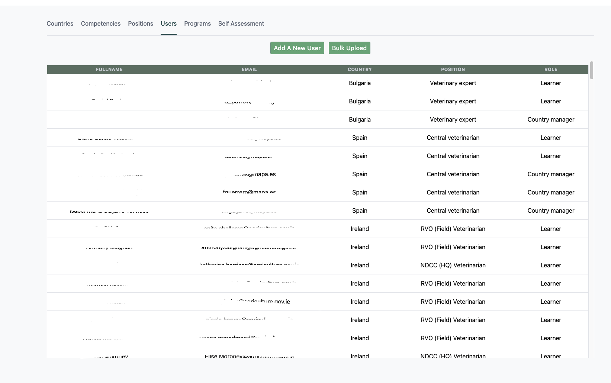

TOM is being piloted in a number of countries including Spain, Bulgaria and Switzerland.

For every pilot, we follow a series of steps to make sure that rollout is smooth for our newly-onboarded users.

## 1. Add new users

You will receive a list of new users from a specific country to add to the database.

For this we have the [TOM Admin tool](https://eufmd-tom.com/#/admin).

Login credentials are `admin@eufmd-tom.com` and `tom@dmin22`.

After logging in, navigate to the "Users" tab in the admin dashboard. Here, you will find a list of already registered users. These users are stored in the production database (`db_tompilot`), specifically in the `users` table. Instead of manually adding each user, the TOM Admin dashboard provides a user-friendly interface that automatically adds new users to the database.

---
