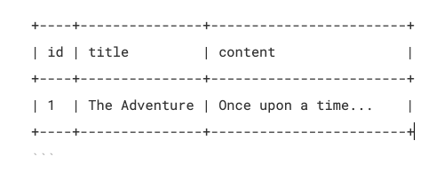

### Understanding Data Flow in a React Application with MySQL and an API

#### Introduction

Building modern web applications often involves fetching data from a backend server and displaying it on the frontend. In this post, we'll explore how data flows from a MySQL database to a React frontend through an API layer. Whether you're new to data flow or looking to reinforce your understanding, this guide will break down each step in a simple and clear manner.

#### What We'll Cover

1.  **MySQL Database**
2.  **API Layer**
3.  **React Frontend**
4.  **Putting It All Together**

### MySQL Database

MySQL is a popular relational database management system (RDBMS) that stores data in tables. Each table has rows and columns, where rows represent individual records and columns represent the attributes of those records.

**Example: `stories` Table**



In this table, we have three columns: `id`, `title`, and `content`. Each row represents a story.

### API Layer

The API (Application Programming Interface) acts as an intermediary between the frontend and the database. It defines a set of endpoints that the frontend can call to perform CRUD (Create, Read, Update, Delete) operations.

**Example API Endpoint**

- `GET /api/stories/:id`: Fetches a story by its ID.

**Node.js/Express API Code**

```
const express = require('express');
const mysql = require('mysql');
const app = express();
const connection = mysql.createConnection({
    host: 'localhost',
    user: 'root',
    password: 'password',
    database: 'stories_db'
});

app.get('/api/stories/:id', (req, res) => {
    const storyId = req.params.id;
    const query = 'SELECT * FROM stories WHERE id = ?';
    connection.query(query, [storyId], (error, results) => {
        if (error) {
            return res.status(500).json({ error: 'Database error' });
        }
        if (results.length > 0) {
            res.json(results[0]);
        } else {
            res.status(404).json({ error: 'Story not found' });
        }
    });
});

app.listen(3000, () => {
    console.log('Server is running on port 3000');
});
```

### React Frontend

React is a JavaScript library for building user interfaces. React components manage their own state and can fetch data from APIs to update the UI dynamically.

**React Component Code**

```
import React, { useState } from 'react';

function Story() {
    const [story, setStory] = useState(null);

    const fetchStory = async (id) => {
        try {
            const response = await fetch(`/api/stories/${id}`);
            const data = await response.json();
            setStory(data);
        } catch (error) {
            console.error('Error fetching story:', error);
        }
    };

    return (
        <div>
            <button onClick={() => fetchStory(1)}>Fetch Story</button>
            {story && (
                <div>
                    <h1>{story.title}</h1>
                    <p>{story.content}</p>
                </div>
            )}
        </div>
    );
}

export default Story;
```

### Putting It All Together

Let's walk through the complete process of fetching and displaying data in a React application.

#### Step 1: User Action (React Component)

A user clicks a button in the React component to fetch a story.

#### Step 2: API Request (Frontend to API)

The React component makes an HTTP GET request to the API endpoint to fetch the story data.

```
const fetchStory = async (id) => {
    try {
        const response = await fetch(`/api/stories/${id}`);
        const data = await response.json();
        setStory(data);
    } catch (error) {
        console.error('Error fetching story:', error);
    }
};
```

#### Step 3: Database Query (API)

The API receives the request, processes it, and sends a SQL query to the MySQL database to retrieve the story data

`SELECT * FROM stories WHERE id = 1;`

#### Step 4: Data Retrieval (Database to API)

The MySQL database executes the SQL query, retrieves the data, and sends it back to the API.

#### Step 5: Response to Frontend (API to Frontend)

The API formats the retrieved data as JSON and sends it back to the React component.

```
{
    "id": 1,
    "title": "The Adventure",
    "content": "Once upon a time..."
}
```

#### Step 6: Rendering (React Component)

The React component receives the data and updates its state, which triggers a re-render to display the story.

```
{story && (
    <div>
        <h1>{story.title}</h1>
        <p>{story.content}</p>
    </div>
)}
```

### Conclusion

By understanding how data flows from a MySQL database to a React frontend through an API layer, you can build more dynamic and responsive web applications. This process ensures that users can interact with data seamlessly, making for a better user experience.

Happy coding!
