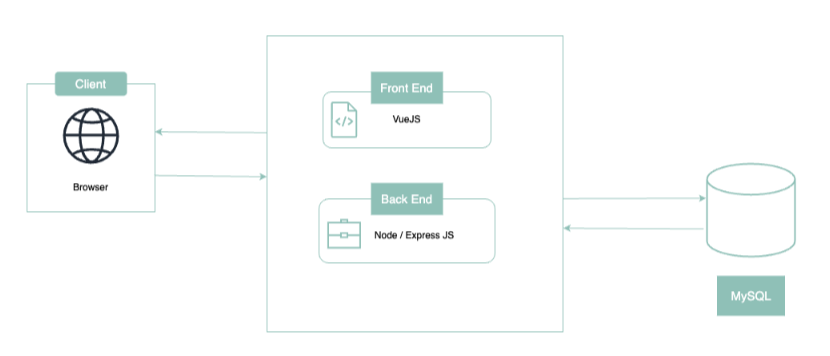

# Architecture Overview

What is the app built on?

TOM is built with a JavaScript stack, with VueJS on the frontend, NodeJS and ExpressJS on the backend, and MySQL for the database.

## Backend

The backend is built on Node.js, Express and a MySQL database. &#x20;

The current version in use is Express 4.18.2 and running on Node 18.15.0. &#x20;

### Real-time Server

We use an Express server within a Node.js framework to sync all real-time changes in our app.

Node.js is an open-source, server-side JavaScript runtime environment built on Chrome's V8 JavaScript engine. It allows developers to run JavaScript code on the server side, enabling them to build scalable network applications with asynchronous, event-driven architecture.

### RESTful API

We use REST for writing our backend APIs. For a guide on getting started with our API, check out this [documentation](https://documenter.getpostman.com/view/12674777/2s9XxvSu8t).

### MySQL

We use MySQL for our database. For a guide on getting started with Postgres, check out this [documentation](https://dev.mysql.com/doc/).

## Frontend

The frontend is built using the Vue.js framework. The current version in use is Vue.js 3.2.13. &#x20;

All dependencies can be found in the table below.

<table data-full-width="false"><thead><tr><th>Package</th><th>Description</th><th>Version</th></tr></thead><tbody><tr><td>Vue.js</td><td>A JavaScript framework used to build the user interface of TOM </td><td>3.2.13 </td></tr><tr><td>Vue Router </td><td>A navigation library for Vue.js</td><td>4.0.4 </td></tr><tr><td>Vuex </td><td>A state management library for Vue.js</td><td>4.0.0 </td></tr><tr><td>LeafletJS </td><td>An open-source JavaScript library for interactive maps</td><td>1.9.3 </td></tr><tr><td>D3.js </td><td>A JavaScript library for producing dynamic, interactive data visualisations in web browsers and is used in the overview dashboard of the country manager view </td><td>7.8.2 </td></tr><tr><td>Papa Parse </td><td>Parses CSV files and is used in the bulk upload feature where CSV files are used</td><td>5.3.2 </td></tr><tr><td>Survey JS / Knockout JS </td><td>A JavaScript form builder used in the self-assessment feature of the learner view </td><td>1.9.70 </td></tr><tr><td>Tailwind CSS </td><td>An open-source CSS framework used for styling </td><td> </td></tr><tr><td>v-idle  </td><td>A JavaScript plugin to detect idle/non-active users and is used in conjunction with login functionality</td><td>0.3.13 </td></tr><tr><td>Vue-dk-toast </td><td>A lightweight toast notification plugin for Vue3 </td><td>3.2.1 </td></tr><tr><td>Vue-pdf-embed </td><td>A package used to embed pdf files in Vue.js applications. This is specifically used in displaying the privacy policy to users </td><td>1.1.4 </td></tr><tr><td>Vue-i18n </td><td>An internalisation plugin used to translate content in the TOM app </td><td>1.1.4 </td></tr></tbody></table>
